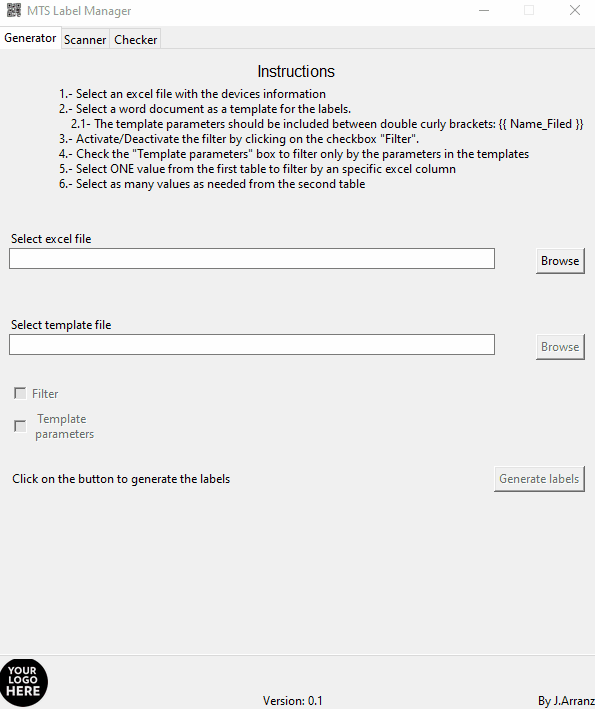
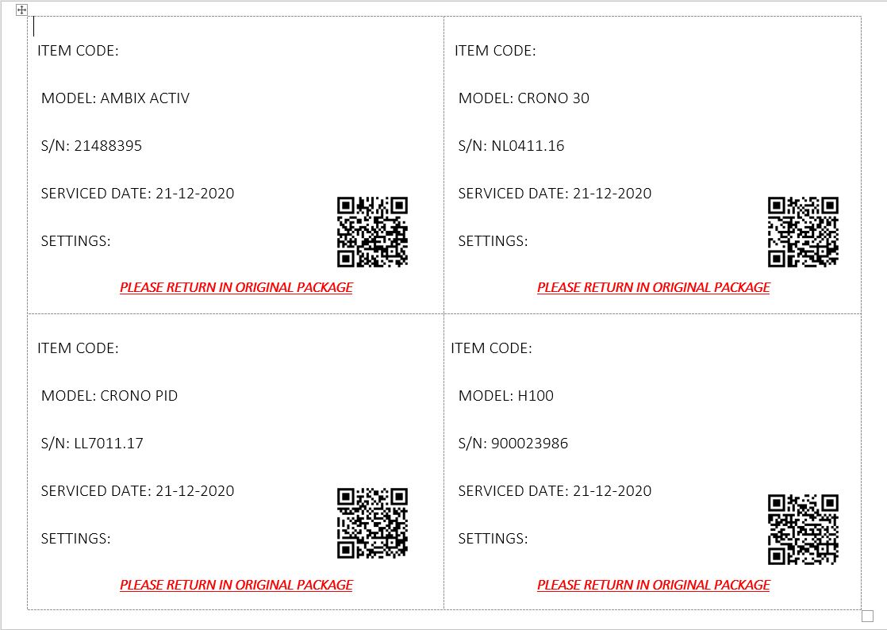
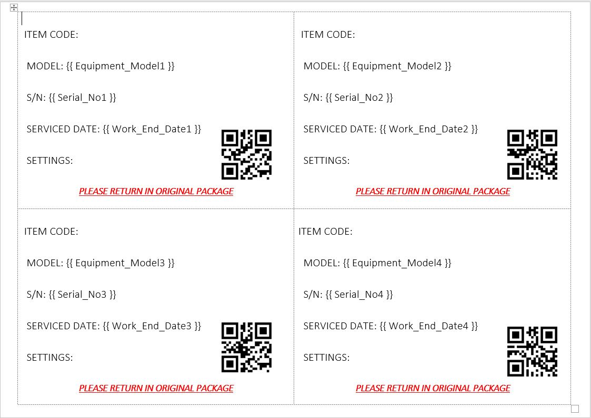
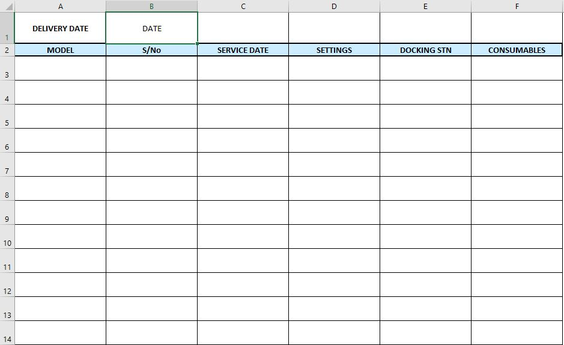

# automated-qr-labels

Automatic label generator including QR identification.

## Description

The program creates and fills labels from a template using data from a specific spreadsheet. It generates a QR code with all the information.
It also includes the tools to create a handover form with all the information contained in the QR code.

## Background

Technical servicing of medical equipment requires constant delivery of parcels. Using established courier delivery services might be expensive, so the parcels are sent directly by the company using their own methods. There was the necessity to facilitate the creation of parcel labels and its posterior reading, which resulted in this tool.

## Usage

To generate the labels
1.	Simply launch the program, using a python interpreter or after compiling the program (e.g., [pyinstaller](https://www.pyinstaller.org/)).
2.	Load the excel file with all the data. Ensure the excel has headers.
3.	Select the label template. 
4.	Optional: Select parameters to filter data.
5.	Generate labels.
6.	Repeat as many times as needed.

**Example of a finished template**

To process the scanned QR:

1.	Open, Create or Select an excel file form to insert the data.
2.	Optional: Insert the request form from the user to have live counting of parcels processed.

**GIF scan QR needed.**

### Templates

#### Label template:

-	The label template must be a docx file, formated as a table.
-	The parameters to include must follow [Jinga2](https://github.com/pallets/jinja) formatting as it is based on [python-docx-template](https://github.com/elapouya/python-docx-template/blob/master/docs/index.rst) module.
-	All QR images contained in the templates should be named as *DummyX* with X as the number of the table cell.
-	The template should be limited to one page.

#### Excel data:

-	It must include headers.
-	Start in cell **A:1**
-	All the headers required to be in the QR must be in the `variableFile.AI`. If in AI but not in label, the date will be introduced in the QR but not in the label.

#### Handover form:

-	Data must start at line 3, with line 2 as headers.
-	Cell **B:1** must be the delivery date.
-	The template should be locked except for the cells where data can be written. The password must be in `variableFile`.
-	To use the analytic tool:
- The client request excel data should start at line 2.
-	There should be at least one column named: *Pump Type* and *Request*

## Limitations and improvement opportunties

-	Client request analysis options are limited to the handover form used by the company. Other forms will have problems reading the labels. See templates for more detail.
-	All possible parameters to include in the labels should be included in the `variableFile` file. If not, it won’t appear in the label or in the QR.
- In order for this program to work it will need the folder `media` and `templates` where the images for the GUI and the template for the handover form are stored. These folders where not include in the github and should be manually included.

## License

MIT. Copyright (c) 2021 Javier Arranz
